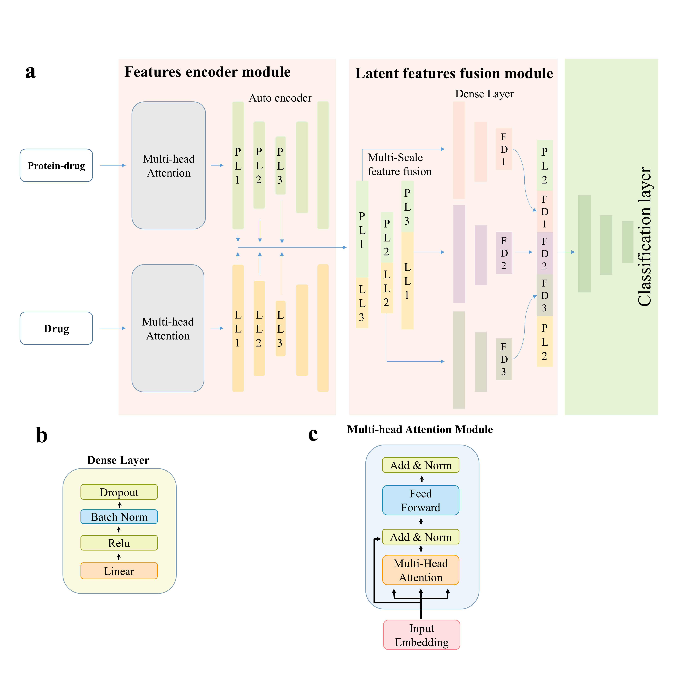

# AttentionScore

<p align="center">
  
</p>

<p align="center">
  <b>A Deep Learning–Based Target-Specific Scoring Function for METTL3 Virtual Screening</b><br/>
  <i>Developed by Dr&nbsp;Muhammad&nbsp;Junaid, Shenzhen University</i>
</p>

---


---

## 📑 Table of Contents
- [Description](#-description)
- [Features](#-features)
- [Workflow](#-workflow)
- [Requirements](#-requirements)
- [Installation](#-installation)
- [Prediction](#-prediction)
- [Streamlit App](#-streamlit-app)
- [Examples](#-examples)
- [Repository Layout](#-repository-layout)
- [Citation](#-citation)
- [License](#-license)

---

## 🧬 Description

**AttentionScore** is a **deep learning–based scoring function** for **structure-based virtual screening (SBVS)** of **METTL3**, a key RNA methyltransferase and emerging anticancer target.

The framework combines a dual-stream network with **multi-head attention** and **autoencoder-style compression**, integrating ligand-centric and interaction-aware descriptors (**Avalon-512**, **ECFP4**, **PLEC-4092**) for robust target-specific prediction.

---

## ✨ Features

- ⚡ **End-to-end pipeline**: from molecules to activity prediction  
- 🧪 **Target-specific**: optimized for **METTL3**  
- 🧠 **Attention + compression** fusion of ligand and interaction features  
- 🔬 **Descriptors**: PLEC (ODDT), Avalon/ECFP4 (RDKit)  
- 🧰 **Two interfaces**:
  - **CLI** (`DeepCGASPred.py`) for scripted prediction on **docked SDF(s)**
  - **Streamlit UI** for **SDF / MOL2 / SMILES** routes (with Open Babel + smina)

---

## 🔄 Workflow

1. **Collect actives & decoys** (e.g., DeepCoy)  
2. **3D preparation** (SMILES → MOL2, 3D + minimization)  
3. **Docking** (smina) → **SDF**  
4. **Feature generation**: **PLEC-4092** (protein–ligand), **Avalon-512** (ligand)  
5. **Training**: dual-stream attention network  
6. **Prediction**: via CLI or Streamlit app

---

## ⚙️ Requirements

- Python **3.9+**
- Recommended conda env in `requirements.yml`
- System tools (as needed):
  - `smina` — required by Streamlit **MOL2**/**SMILES** routes for docking  
  - `obabel` (Open Babel CLI) — required by Streamlit **SMILES** route for 3D building
- Python packages (prediction):
  - `numpy`, `pandas`, `torch`, `rdkit-pypi`, `oddt`, `tqdm`
  - `streamlit`, `requests` (for the UI)

---

## 🏁 Installation

Using **conda** (recommended):
```
bash
conda env create -f requirements.yml
conda activate DeepMETLL3
```

---

## 🚀 Prediction

AttentioScore.py runs end-to-end prediction from docked complexes (SDF) using PLEC-4092 (with your receptor PDB) and Avalon-512, then applies the trained AttentionScore model.

Usage
```
bash
python AttentionScore.py \
  -r <receptor.pdb> \
  -l <docked.sdf | directory_of_sdfs | multi_conf.sdf> \
  -o <output.csv> \
  --model </path/to/model_FullModel.pth> \
  [--max-per-file N] [--cpu]
```
Required arguments
`-r`, --receptor : path to receptor PDB (used for PLEC features)\
`-l`, --ligands : a single docked SDF, a multi-conformer SDF, or a directory of .sdf\
`-o`, `--out` : output CSV path\
`--model` : path to your trained AttentionScore checkpoint (.pth)\
Optional flags\
`--max-per-file` N : when -l is a multi-conformer SDF, limit to the first N entries per file (default: all)\
`--cpu` : force CPU inference (helpful on low-VRAM GPUs)\
Examples\
Single SDF (one complex):
```
python scripts/DeepCGASPred.py -r receptor.pdb -l docked.sdf -o out.csv --model /path/to/model_FullModel.pth
```
All SDFs in a folder:
```
python scripts/DeepCGASPred.py -r receptor.pdb -l /path/to/docked_sdf_dir -o out.csv --model /path/to/model_FullModel.pth
```
Multi-conformer SDF (take first 10), CPU only:
```
python scripts/DeepCGASPred.py -r receptor.pdb -l docked_multi.sdf -o out.csv --max-per-file 10 --cpu
```
Output columns
molecule — title/index from SDF
smiles — taken from SDF or recovered via RDKit
source — input SDF path
probability — predicted activity probability (0–1)
activity — binary class (1=Active, 0=Inactive)
activity_label — human-readable label
Note: The CLI expects docked SDFs. If you only have MOL2 or SMILES, use the Streamlit app to run Open Babel + smina + prediction in one place.
